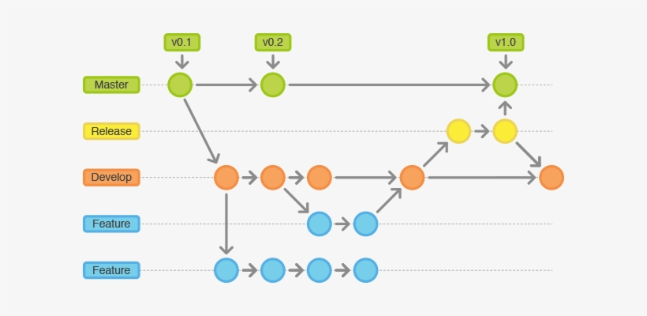
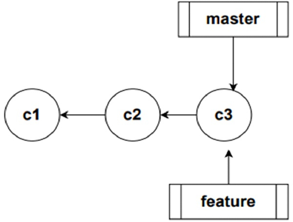
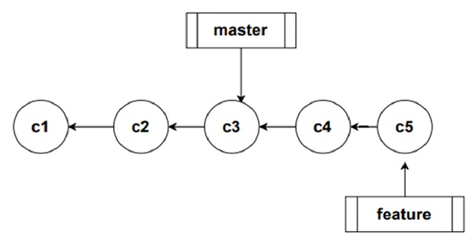
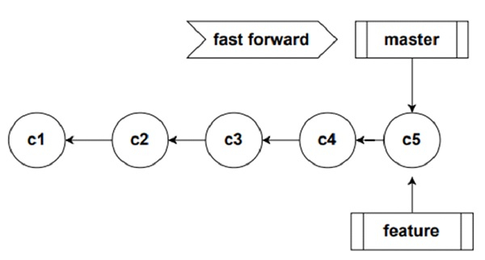
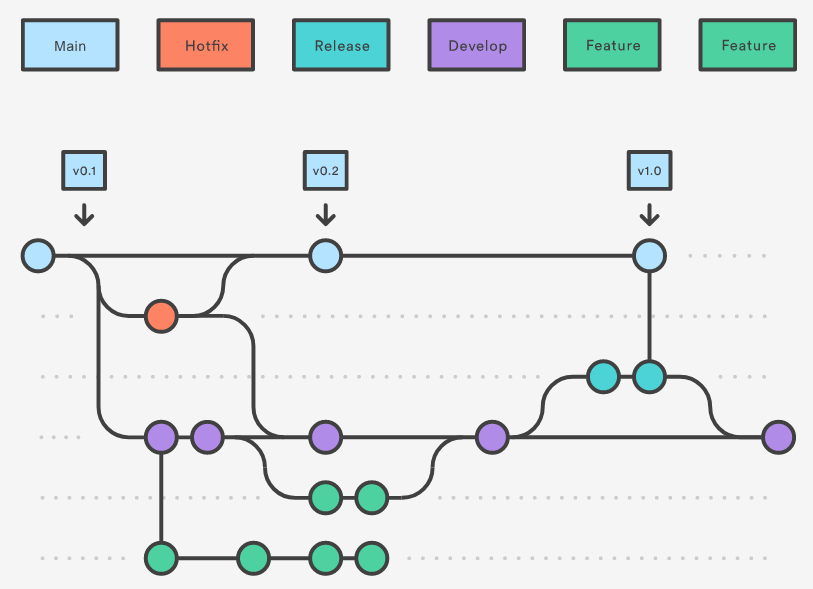

# Esta es la práctica de la SCESI :D

## ¿Qué es Git?

Git es un sistema de control de versiones que permite registrar los diferentes cambios que se realizan en un proyecto.

- ### Repositorio 

    

    Un repositorio es un directorio al cual Git le está haciendo seguimiento. Para que git realice dicha tarea, se debe dirigir a la carpeta en cuestión y utilizar el comando:
    ~~~~
    git init
    ~~~~
    

- ### Directorios más importantes de un repositorio

    1. #### Working 
        El working area es aquel en el cual se manipulan los archivos (se realizan cambios).
    2. #### Staging 
        El staging area es aquel en el cual se agregan los archivos a los que se les quiere realizar un commit. Para visualizar los cambios que aún no han sido enviados al Git area se debe emplear el comando:
        ~~~~
        git status
        ~~~~
        Si se desea visualizar cómo son exactamente los cambios que no se encuentran en el staging area respecto al último commit realizado, se debe emplear el comando:
        ~~~~
        git diff
        ~~~~
        Para enviar los cambios realizados al staging area se debe emplear el comando:
        ~~~~
        git add <nombre del archivo modificado>
        ~~~~
        Para retirar algún cambio del staging area se puede usar le siguiente comando:
        ~~~~
        git reset <nombre del archivo modificado>
        ~~~~ 
    3. #### Git 
        El git area es aquel en el cual se tienen almacenados todos los commits del repositorio.

- ### Commit. - 

    

    Un commit es el registro de un cambio realizado en un determinado repositorio. Todo commit es realizado manualmente y debe incluir una breve explicación de lo sucedido. El comando que debe emplearse 
    para enviar un cambio desde el Staging area al Git area es:
    ~~~~
        git commit
    ~~~~

    Dicho comando mostrará un apartado en el cual se debe introducir una breve descripción del commit realizado.

- ### Ramificar y Fusionar (Branch and Merge) 

    

    La ramificación y la fusión son carácterísticas muy utiles de git pues permiten el trabajo de manera paralela. Un repositorio está estructurado como un arbol que tiene diferentes ramas. La rama principal de este arbol es llamada Master. A partir de cada rama se pueden crear nuevas (al momento de crear una rama esta contiene todos los commits de su rama origen) estas ramas se pueden usar para desarrollar una carácteristica nueva, experimentar o también para independizar el trabajo de cada miembro del equipo de desarrollo, los cambios hechos en una rama no afectan a la origen. Las ramas existen para que en algún momento vuelvan a ser acopladas entre ellas, esta acción es denominada "fusión" o "merge", una fusión consiste en unir los cambios realizados en las ramas participantes.

    #### Comandos para Ramificación y Fusión:

    ~~~~
    - git branch Permite ver el árbol del repositorio.

    - git branch <rama> Crea la rama 'rama'

    - git checkout <rama destino> Permite desplazarnos entre ramas.

    - git merge <rama> Permite fusionar la rama 'rama' a la actual.
    ~~~~

    #### Conflictos
    Existen casos en los cuales un mismo archivo ha sido modificado en dos ramas diferentes, en este caso, al realizar la fusión de dichas ramas ocurrirá un conflicto. Los conflictos ocurren cuando Git no sabe cual de los cambios realizados al archivo en las diferentes ramas debe mantener y cuales debe descartar. Los conflictos pueden ser resueltos manualmente o se puede escoger priorizar la información de una rama en concreto al momento de realizar un merge.

    Para priorizar los cambios de la rama actual al momento de realizar un merge se debe emplear el comando:

    ~~~~
    git merge -s ours
    ~~~~

    #### Fast Forward
    Sean las ramas rama1 y rama2 donde rama2 fue creada desde rama1. Si se realizan cambios en una y solamente una de las dos ramas, al momento de realizarse un merge no se creará un commit indicando el hecho pues existe un camino lineal directo desde la rama que no ha cambiado a la rama que si lo hizo.
    

    
 Dos ramas apuntando al mismo commit

    

    
 Commits realizados en la rama "feature"

    

    
 Fast Forward realizado al momento de hacer un merge

    Para que un merge no se realice con fast forward, se puede emplear el comando siguiente:
    ~~~~
    git merge --no-ff <rama>
    ~~~~

- ### Flujos de trabajo 
    
    Un flujo de trabajo es un conjunto de reglas que se siguen para desarrollar un proyecto de manera ordenada y eficiente haciendo uso de Git.

    - #### Basic workflow
        Se usa solamente la rama master para realizar los diferentes commits, es recomendado para proyectos pequeños e individuales.

        

    
    - #### Feature branch workflow
        Flujo de trabajo en el cual se establece una rama para cada carácteristica nueva que se encuentre en desarrollo, es recomendado para trabajar en conjunto con otras personas en proyectos pequeños.

        

    - #### Gitflow workflow
        Flujo de trabajo usado para el desarrollo de proyectos grandes, se caracteriza por definir unas determinadas ramas por defecto:

        - ##### Main o Master
            Rama en la que se ubican las versiones lanzadas al usuario final.
        - ##### Hotfix
            Rama empleada para la corrección de errores de las versiones lanzadas al publico, se integra a Develop y Master.
        - ##### Release
            Rama empleada para la aplicación de los últimos detalles al proyecto previo a un lanzamiento, se integra a Develop y Master.
        - ##### Develop
            Rama utilizada para el desarrollo de la aplicación.

        - ##### Feature
            Ramas (existe una rama Feature por cada caracteristica en desarrollo) empleadas para el desarrollo de una caracteristica, estas se integran a la rama Develop.
        
        

    
    - #### Forking workflow
        Flujo de trabajo en el cual cada colaborador realiza una copia del proyecto completo, la cual se convierte en su repositorio personal público, una vez posee dicha copia, procede a realizar un git clone del repositorio en su máquina local para realizar diferentes cambios. Una vez el colaborador termina su trabajo realiza un push a su repositorio personal y posteriormente realiza un pull request al proyecto original para que sus cambios sean aceptados o rechazados. Para mantenerse al día con los cambios realizados en la versión oficial del proyecto, cada colaborador tiene otro remote que apunta al repositorio original a parte del que tienen apuntando a su copia.

        

